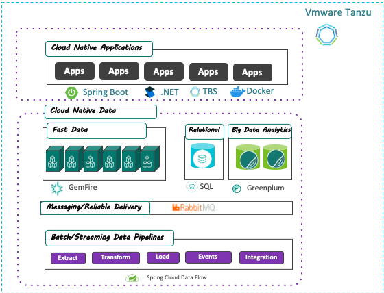

### What is Tanzu Data?

**Tanzu Data** is a _multi-cloud_, _multi-platform_ portfolio of messaging, integration, database, warehouse and management solutions for modern applications.

In this session, we will demonstrate some of the major features of the **Tanzu Data Services** portfolio by building and deploying a **Petclinic Dashboard**. This will be the realtime analytics portal for our **Petclinic** app. 

#### What we will need
1. **A cloud-native data pipeline.** We will use **Spring Cloud Data Flow** to deploy a realtime data pipeline which will feed our Dashboard's **Alerts** system. This is the module that will send us push notifications when new data is available. The data pipeline will use **Petclinic** app's **Tanzu MySQL** backend as its source and **log** as its sink, and it will use **Tanzu RabbitMQ** as the message broker. Simultaneously, using its **multi-IO streaming** feature, it will also send data to a second sink using its **Change Data Capture** connector.
2. **A data warehouse store for cross-domain data analysis.** We will ingest **point of service** data from the Petclinic app, **social data** and **simulated RFID data** into a **Tanzu Greenplum** cluster and use it to generate an adhoc geographical visualization of pet trends using Greenplum's **PostGIS** and **GPText** libraries. We will use Greenplum's **PXF Federated Queries** to include the Petclinic's MySQL backend in our adhoc query. Also, we will use our **Wavefront** integration to detect the **elastic scalability** of our Greenplum cluster in its scaling up and down to accomodate the changing volume of data.
3. **A realtime scoring systen.** Simultaneously, we will deploy an ML model that will use clustering algorithms to recommend **High Viability Zones** for petclinic expansion. We will handle training and inference of our model using Greenplum's **Apache MADlib**, and accelerate model serving by integrating with **Tanzu Gemfire**.
4. **A management control plane.** We will show how we accomplish DBaaS: managing and monitoring multiple data clusters using **Data Management for Tanzu**.
5. **A reliable and elastic data architecture with fast data ingest.** We will demonstrate the resiliency, availability and streamlined operability of our data architecture by showing the **self-healing** and **continuous availability** of both the data nodes and the Dashboard app during an upgrade. We will also show its resilience despite randomly killing off nodes in the architecture.

Let's get started!