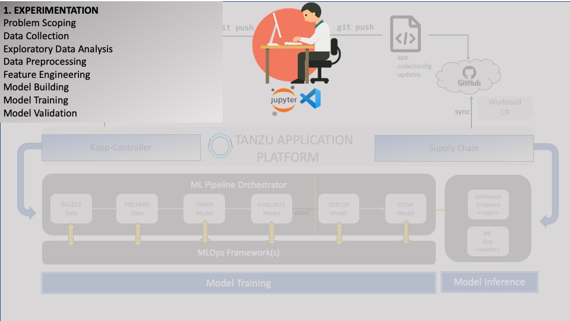

### Deploying JupyterHub

Before we begin, we need to set up a development environment that will allow us to perform **experiments** that will help us to understand how to build an optimized model for our problem statement.
This is a part of the **Discovery** phase.

<div style="text-align: left; justify-content: left; align-items: center; width: 80%; margin-bottom: 20px; font-size: small">
     
    Deploying the ML development environment is usually the responsibility of the <b>ML engineer</b>.
    A data scientist shouldn't have to worry about this task unless (s)he wears multiple hats on the project, 
    or needs access to a development environment via <b>self-service provisioning</b>.
</div>
<div style="clear: left;"></div>



Experimentation is an **iterative** process and requires the ability to perform **rapid model development**, **track** and **audit** experiment runs,
and **collaborate** and **share** results with the team.

**JupyterHub** is a popular tool that data scientists use for this purpose.
It is used for hosting **Jupyter notebooks**.
A **Jupyter notebook** provides a browser-based IDE that enables live coding, experimentation, data exploration and model engineering.
**JupyterHub** is a containerized, open-source app, making it easy to deploy on **TAP**.

Let's begin!

#### How to deploy

The simplest way to deploy apps on **TAP** is by using the **tanzu cli**.
This allows **TAP** to use a single-line install to deploy apps that have been previously packaged as **Carvel Packages**.
**TAP** comes with a number of pre-installed Packages, and supports the ability to discover and add new Packages.
Any containerized app can be transformed into a **Carvel Package**, with an associated source repository called a **PackageRepository**,
making it ready to install on **TAP**.

First, let's take a look at the JupyterHub Package Repository that we wish to install:
```dashboard:open-url
url: https://hub.docker.com/r/{{DATA_E2E_REGISTRY_USERNAME}}/jupyter-package-repo
```

We will reference the path to the registry for the install as our _url_ parameter.

Let's go ahead and install the JupyterHub Package Repository:
```execute
tanzu package repository add jupyterhub-package-repository --url {{DATA_E2E_REGISTRY_USERNAME}}/jupyter-package-repo:{{DATA_E2E_JUPYTERHUB_VERSION}} -n {{session_namespace}}
```

Next, let's verify that the Jupyterhub package is now available:
```execute
tanzu package available list jupyter.tanzu.vmware.com -n {{session_namespace}}
```

As a next step, we may want to update the default configuration values associated with the Jupyterhub package.
To do this, let's view our options by showing the **values schema**:
```execute
tanzu package available get jupyter.tanzu.vmware.com/{{DATA_E2E_JUPYTERHUB_VERSION}} --values-schema -n {{session_namespace}}
```

In our case, we'd like to update a few of the properties shown. 
We do this by preparing a **values.yaml** file with the schema properties we want to update.
Let's generate the file:
```execute
cat > ~/other/resources/jupyterhub/jupyter-values.yaml <<- EOF
namespace: {{ session_namespace }}
image: {{DATA_E2E_REGISTRY_USERNAME}}/jupyter-package-repo:{{DATA_E2E_JUPYTERHUB_VERSION}}
version: {{DATA_E2E_JUPYTERHUB_VERSION}}
base_domain: {{DATA_E2E_BASE_URL}}
container_repo_user: {{DATA_E2E_REGISTRY_USERNAME}}
EOF
```

Here's the final **values.yaml** file:
```editor:open-file
file: ~/other/resources/jupyterhub/jupyter-values.yaml
```

Now we can proceed to install the package:
```execute
tanzu package install jupyterhub -p jupyter.tanzu.vmware.com -v {{DATA_E2E_JUPYTERHUB_VERSION}} --values-file ~/other/resources/jupyterhub/jupyter-values.yaml -n {{session_namespace}}
```

Verify that the install was successful:
```execute
tanzu package installed get jupyterhub -n {{session_namespace}}
```

Next, we view it (login with the default username and password used above - jupyter/Vmware1!):
```dashboard:open-url
url: {{ ingress_protocol }}://jupyter-{{session_namespace}}.{{ ingress_domain }}
```

We also need to be able to track our experiments, including properties like metrics and artifacts.
In addition, we want to be able to store our models in some kind of Model Registry.
For this and more, we will need to leverage an **MLOps** framework.
We will deploy this next.


