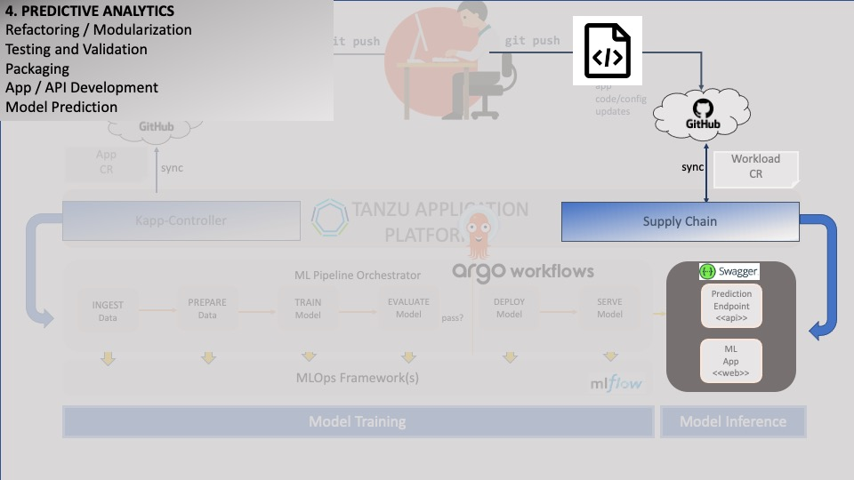

### Building and Deploying Predictive Apps



Now we will deploy the predictive apps that will consume the Tensorflow model we built previously, 
and use it to generate image label predictions. With **TAP**, we are able to deploy our ML apps 
along with our models using the same GitOps-ready platform.

Our sample ML code includes a **Streamlit** web app which will accept an uploaded image and return its predicted label for it.
It will also display some of the model's performance metrics which were evaluated during training, as a point of reference.

Let's take a quick look at the main module which will drive the app:
```editor:open-file
file: ~/sample-ml-app/app/analytics/home.py
```

Next, we need the GitOps code that will handle the deployment and lifecycle management of the app. 
Again, this is made easy with **TAP**.
For our web app, we will use of the resource called **Workloads**,
which make use of out-of-the-box pipelines called **Supply Chains** to manage the app.

Let's see if we can reuse an existing Workload template from our **Accelerator** portal. 
Navigate to the **TAP GUI**:
```dashboard:open-url
url: {{ ingress_protocol }}://tap-gui.{{ ingress_domain }}/create
```

Click on the "+" menu icon (left panel), and enter "project" in the search field. 
Then, click "Choose", enter "test" in all the required fields, and click "Explore File".
In the pop-up that displays, you should be able to navigate to the _config/workload.yaml_ file.

Here's the manifest that we will use to deploy the app:
```editor:open-file
file: ~/other/resources/tapworkloads/workload.yaml
text: "type: openapi"
after: 3
```

Note that it includes an "openapi" field, which will be used to render an OpenAPI-3 compatible interface.
The app uses **FastAPI** to expose its APIs - here is the code:
```editor:open-file
file: ~/sample-ml-app/app/analytics/api.py
```

Now, let's deploy the app:
```execute
tanzu apps workload create image-processor -f ~/other/resources/tapworkloads/workload.yaml --yes -n {{session_namespace}}
```

While our app is deploying, let's see a previously deployed example of what the workflow should look like.

Navigate to a pre-existing deployment of MLflow:
```dashboard:open-url
url: {{ ingress_protocol }}://mlflow.{{ ingress_domain }}
```

Select the **convolutional_neural_network_team_main** experiment (on the left), 
and enter **metrics.accuracy_score > 0.5** in the search field, then select the run in the search results.
Notice the tracked fields in the **Metrics** and **Artifacts** section; these were tracked and stored during the model training phase.

Also, select **test.html** under the **Artifacts** section. This will display a report of performance metrics, explainability, etc. 
that were captured during **Monitoring**. (The library used is called **Evidently**: <a href="https://docs.evidentlyai.com/" target="_blank">View Home Page</a>)

Next, select the **Models** tab. There should be several candidate models shown. 
The selected candidate model should show up as **cifar_cnn**. The model can be promoted (or demoted) through the UI, as shown,
or programmatically (during the training).

Navigate to a pre-existing sample app deployment by clicking on the URL from the **tanzu** cli:
```execute
tanzu apps workload get image-processor --namespace default
```

To test the app, download images from the **Jupyter** tab. Navigate to **/jupyter/test-images** from the left panel,
right-click on an image and select "Download".
Upload a few of these images to the app and observe the predictions it yields.


<font color="red">NOTE: If it shows "Training is in progress",
then it means that it could not locate any ML model named **cifar_cnn** that is in the **Production** phase.
Navigate to MLflow above to change the Model Stage from the Models tab.</font>

Let's also view the **OpenAPI** interface for the model's serving API - click on the link for the app, then click on the **Definitions** tab:
```dashboard:open-url
url: {{ ingress_protocol }}://tap-gui.{{ ingress_domain }}/api-docs
```

Last, view the pipeline that was used to build the model:
```dashboard:open-url
url: https://argo-workflows.{{ ingress_domain }}
```


