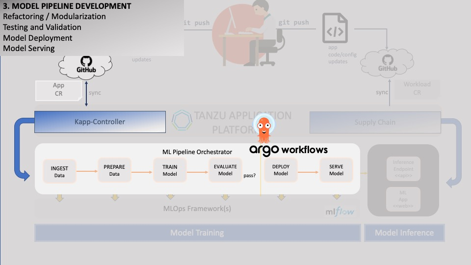

### Deploying ML Pipeline



After **packaging** and **containerizing** our ML model code, we will need to setup an **ML pipeline** to handle its orchestration.

For this, we will use **Argo Workflows**. **Argo Workflows** is backed by the popular GitOps engine **ArgoCD**, which has built-in support in **TAP**.

(<font color="red">NOTE:</font> Learn more about Argo Workflows here: <a href="https://argoproj.github.io/argo-workflows/" target="_blank">Argo Workflows</a>)

<div style="text-align: left; justify-content: left; align-items: center; width: 80%; margin-bottom: 20px; font-size: small">
     
    Argo Workflows was deployed to TAP using a template provided by an <b>Accelerator</b>.
    For more info, search for <b>argo</b> on the TAP Accelerators page.
</div>
<div style="clear: left;"></div>

View Argo Workflows in the TAP GUI - the Argo Workflows app should be visible:
```dashboard:open-url
url: {{ ingress_protocol }}://tap-gui.{{ ingress_domain }}/supply-chain
```

Launch Argo Workflows by retrieving the URL from the **tanzu cli** (you may need to click on the topmost menu tab on the left to see the initial screen):
```execute
tanzu apps workload get argoworkflows-tap --namespace default
```

<div style="text-align: left; justify-content: left; align-items: center; width: 80%; margin-bottom: 20px; font-size: small">
    
    <b>Why should we use a pipeline orchestrator?</b><br/>
    By decoupling the pipeline from its orchestration, it is easier to perform management tasks like retries and rollbacks.
    Orchestration also helps with standardizing pipeline deployment for reuse/repeatability, 
    and decoupling pipeline steps for greater flexibility and integration: for example, it provides the ability 
    to leverage multiple languages and frameworks in the same pipeline.
</div>

<font color="red">NOTE:</font> Copy the access token from here to the Login box:
```execute
clear; kubectl -n argo exec $(kubectl get pod -n argo -l 'app=argo-server' -o jsonpath='{.items[0].metadata.name}') -- argo auth token
```

Let's view the manifest for our Argo Workflow:
```editor:select-matching-text
file: ~/other/resources/argo-workflows/pipeline.yaml
text: "steps:"
after: 23
```

We can see that the workflow comprises of *4* steps - 
**upload_dataset**, **train-model**, **evaluate-model** and **promote-model-to-staging** -
with a set of **parameters** for each step.

In keeping with our MLDevOps approach, we would like our pipeline deployment to be as automated as possible.
With **TAP**, using a **GitOps**-ready deployment approach is easy. There are many supported flavors.
One of the simplest is to use the **AppCR** resource, which is backed by Carvel's **kapp-controller**.
With AppCR, we can use a lightweight approach to employ a declarative, Infrastructure-as-Code deployment,
allowing us to use our git repository as the source of truth that takes care of synching up our latest changes with our environment.

(<font color="red">NOTE:</font> Learn more about App CR here: <a href="https://carvel.dev/kapp-controller/docs/v0.38.0/app-overview/" target="_blank">Argo Workflows</a>)

Let's view the manifest for our App CR:
```editor:open-file
file: ~/other/resources/appcr/pipeline_app_main.yaml
```

Once deployed, **TAP** will take care of monitoring the App's resources and tracking when there are changes to the git repo source.
(**TAP** does this by leveraging **kapp-controller**, which is another built-in that comes with **TAP**.)

Let's copy the App CR and pipeline files to our ML code directory:
```execute
cp ~/other/resources/appcr/pipeline_app_main.yaml ~/sample-ml-app/pipeline_app.yaml && cp ~/other/resources/appcr/values_main.yaml ~/sample-ml-app/values.yaml && cp ~/other/resources/argo-workflows/pipeline.yaml ~/sample-ml-app/pipeline.yaml
```

Our directory now looks like this:
```execute
ls -ltr ~/sample-ml-app
```

To kick off pipeline orchestration for our ML pipeline, let's commit the App CR to Git and deploy the App CR:
```execute
cd ~/sample-ml-app; git config --global user.email 'eduk8s@example.com'; git config --global user.name 'Educates'; git add .; git commit -m 'New commit'; git push origin main-{{session_namespace}}; cd -; kapp deploy -a image-procesor-pipeline-{{session_namespace}} -f ~/sample-ml-app/pipeline_app.yaml --logs -y  -nargo
```

Our newly deployed pipeline should now be visible. 
```dashboard:open-url
url: https://argo-workflows.{{ ingress_domain }}
```

Training a CNN model can take a while. 
In a few minutes, we should be able to access a newly trained ML model in MlFlow. 
Let's proceed to see what that looks like.


