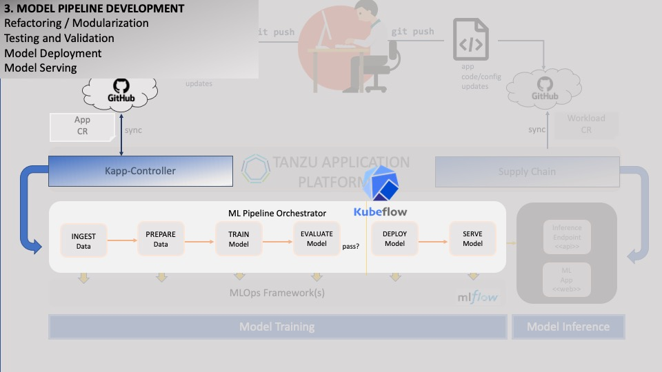

### Deploying ML Pipeline



After **packaging** and **containerizing** our ML model code, we will need to setup an **ML pipeline** to handle its orchestration.

For this, we will use **Kubeflow Pipelines**. **Kubeflow Pipelines** comes from the popular MLOps toolset **Kubeflow**, which 
is a broad suite that consists of various components: native Jupyter Notebook integration, 
model serving, native integration with popular ML frameworks like Tensorflow/Keras, 
extensive add-on support like Elyra for UI-based pipeline design and Kale for extending JupyterLab notebooks, etc.
In this case, we will only be using **Kubeflow Pipelines** , which is the pipeline orchestration component.
Also, it is backed by the popular workflow orchestrator **Argo Workflows**, whose backend - **ArgoCD** - has built-in support in **TAP**.

(<font color="red">NOTE:</font> Learn more about Kubeflow Pipelines here: <a href="https://www.kubeflow.org/docs/components/pipelines/v1/introduction/" target="_blank">Argo Workflows</a>)

Similarly to how we deployed **MLflow**, we will deploy **Kubeflow Pipelines** on **TAP** using the **tanzu** cli.
Let's try it - first, we install the Kubeflow Package Repository:
```execute
clear; export KUBEFLOW_PACKAGE_VERSION=0.0.1; tanzu package repository add kubeflow-pipelines --url ghcr.io/agapebondservant/kubeflow-pipelines:$KUBEFLOW_PACKAGE_VERSION -n {{session_namespace}}
```

Next, we install the Kubeflow Package:
```execute
tanzu package install kubeflow-pipelines --package-name kubeflow-pipelines.tanzu.vmware.com --version $KUBEFLOW_PACKAGE_VERSION -n {{session_namespace}}
```

*Verify that the installation was successful:
```
tanzu package installed get kubeflow-pipelines -n{{session_namespace}}
```

With that, you should be able to access Kubeflow Pipelines:
```dashboard:create-dashboard
name: Kubeflow
url: {{ ingress_protocol }}://kubeflow-{{ session_namespace }}.{{ ingress_domain }}
```

Let's view the source code for our Kubeflow Pipeline:
```editor:open-file
file: ~/other/resources/argo-workflows/pipeline.yaml
```

We can see that the workflow comprises of *4* steps -
**upload_dataset**, **train-model**, **evaluate-model** and **promote-model-to-staging** -
with a set of **parameters** for each step.

In keeping with our MLDevOps approach, we would like our pipeline deployment to be as automated as possible.
With **TAP**, using a **GitOps**-ready deployment approach is easy. There are many supported flavors.
One of the simplest is to use the **AppCR** resource, which is backed by Carvel's **kapp-controller**.
With AppCR, we can use a lightweight approach to employ a declarative, Infrastructure-as-Code deployment,
allowing us to use our git repository as the source of truth that takes care of synching up our latest changes with our environment.

(<font color="red">NOTE:</font> Learn more about App CR here: <a href="https://carvel.dev/kapp-controller/docs/v0.38.0/app-overview/" target="_blank">Argo Workflows</a>)

Let's view the manifest for our App CR:
```editor:open-file
file: ~/other/resources/appcr/pipeline_app_main.yaml
```

Once deployed, **TAP** will take care of monitoring the App's resources and tracking when there are changes to the git repo source.
(**TAP** does this by leveraging **kapp-controller**, which is another built-in that comes with **TAP**.)

Let's copy the App CR and pipeline files to our ML code directory:
```execute
cp ~/other/resources/appcr/pipeline_app_main.yaml ~/sample-ml-app/pipeline_app.yaml && cp ~/other/resources/appcr/values_main.yaml ~/sample-ml-app/values.yaml && cp ~/other/resources/argo-workflows/pipeline.yaml ~/sample-ml-app/pipeline.yaml
```

Our directory now looks like this:
```editor:open-file
file: ~/sample-ml-app/pipeline_app.yaml
```

Let's deploy the App CR:
```execute
kapp deploy -a image-procesor-pipeline-{{session_namespace}} -f ~/sample-ml-app/pipeline_app.yaml --logs -y  -n{{session_namespace}}
```

Our newly deployed pipeline should now be visible.
```dashboard:reload-dashboard
name: Kubeflow
url: {{ ingress_protocol }}://kubeflow-{{ session_namespace }}.{{ ingress_domain }}
```

In a few minutes, we should be able to access a newly trained ML model in MlFlow.
Let's proceed to see what that looks like.


