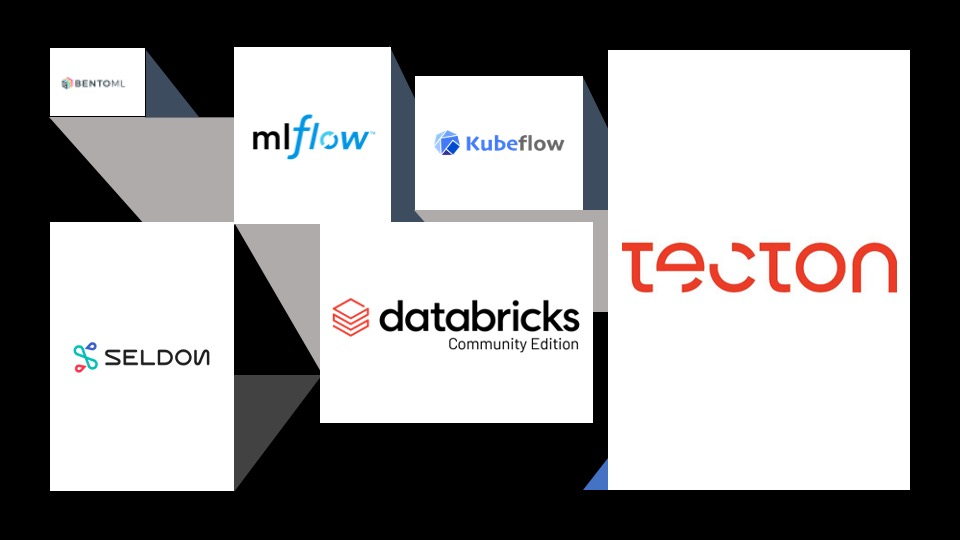
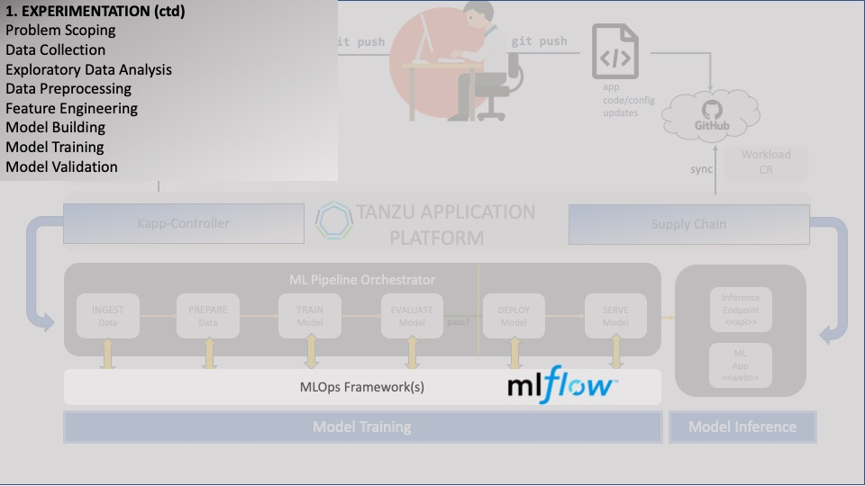

### Building ML Model Workflow

<div style="text-align: left; justify-content: left; align-items: center; width: 80%; margin-bottom: 20px; font-size: small">
     
    Deploying the MLOps platform is usually the responsibility of the <b>ML engineer</b>.
    A data scientist shouldn't have to worry about this task unless (s)he wears multiple hats on the project, 
    or needs access to an MLOps platform via <b>self-service provisioning</b>.
</div>
<div style="clear: left;"></div>

Building, training and deploying ML models requires several pre-conditions in order to be successful:
* The ability to **deploy** ML models in a **repeatable**, **portable** and **agile** manner;
* The ability to **track** changes to models, including their associated artifacts, metrics, parameters/hyperparameters, etc;
* The ability to track and evaluate model **performance**;
* The ability to store models in a collaborative **registry**;
* The ability to **serve** models via well-documented APIs; etc.

There are several **MLOps** open-source tools which can provide these features:


The problem is that different tools often provide different features (at differing levels of maturity/suitability for our use case). 
And sometimes, we would like **mix-and-match flexibility** so that we can easily combine desired features from different tools 
without always having to lock-in to a single vendor. This flexibility is one of the main value propositions of **TAP**, and 
we will be taking advantage of it here.

For the core machine learning workflow, we will use **MLflow**. **MLflow** is a lightweight, cloud-native MLOps solution
which provides the ability to mix-and-match with other frameworks where necessary. 


(<font color="red">NOTE:</font> You can learn more about MLflow here: <a href="https://mlflow.org/" target="_blank">MLflow</a>)

(With **MLflow**, an additional **orchestration layer** is required to deploy our machine learning code as 
an **ML pipeline**, with loosely coupled, scalable, resilient, portable steps.
We will set up the orchestration later in the workshop.)

Let's begin!

#### How to deploy

First, MLflow requires a few dependencies: a backend store and an artifact store.
We'll use Postgres and Minio respectively for our dependencies.
Let's pre-install those (<font color="red">NOTE: This may take a while:</font>)
```execute
clear && sed -i "s/YOUR_SESSION_NAMESPACE/{{ session_namespace }}/g" ~/other/resources/postgres/openssl.conf && openssl genrsa -out tls.key 2048 && openssl req -new -x509 -nodes -days 730 -key tls.key -out tls.crt -config ~/other/resources/postgres/openssl.conf && kubectl delete secret tls-ssl-postgres --namespace {{session_namespace}} || true && kubectl create secret generic tls-ssl-postgres --from-file=tls.key --from-file=tls.crt --from-file=ca.crt=tls.crt --namespace {{session_namespace}}; kubectl wait --for=condition=Ready pod -l app=postgres-operator --timeout=120s; kubectl apply -f ~/other/resources/postgres/postgres-ml-cluster.yaml --namespace {{session_namespace}} && helm repo add minio-legacy https://helm.min.io/ && helm install --set resources.requests.memory=1.5Gi,tls.enabled=false --namespace {{session_namespace}} minio minio-legacy/minio --set service.type=LoadBalancer --set service.port=9000 && sed -i "s/YOUR_SESSION_NAMESPACE/{{ session_namespace }}/g" ~/other/resources/minio/minio-ml-http-proxy.yaml && kubectl apply -f ~/other/resources/minio/minio-ml-http-proxy.yaml --namespace {{session_namespace}} && export AWS_ACCESS_KEY_ID=$(kubectl get secret minio -o jsonpath="{.data.accesskey}" -n {{session_namespace}}| base64 --decode) && export AWS_SECRET_ACCESS_KEY=$(kubectl get secret minio -o jsonpath="{.data.secretkey}" -n {{session_namespace}}| base64 --decode) && kubectl wait --for=condition=Ready pod -l app=minio --timeout=300s -n {{session_namespace}} && mc config host add --insecure data-e2e-minio-ml http://minio-{{session_namespace}}.{{ ingress_domain }} ${AWS_ACCESS_KEY_ID} ${AWS_SECRET_ACCESS_KEY}; sleep 7; mc mb --insecure -p data-e2e-minio-ml/mlflow && mc policy --insecure set public data-e2e-minio-ml/mlflow 
```

Now, let's go ahead and install the MLflow Package Repository:
```execute
tanzu package repository add mlflow-package-repository --url {{DATA_E2E_REGISTRY_USERNAME}}/mlflow-packages-repo:1.0.0 -n {{session_namespace}}
```

Next, we may want to update the default configuration values associated with the MLflow package.
To do this, let's view our options by showing the **values schema**:
```execute
tanzu package available get mlflow.tanzu.vmware.com/1.0.0 --values-schema -n {{session_namespace}}
```

In our case, we'd like to update the properties shown.
We'll use this script to generate our **values.yaml** file:
```execute
export MLFLOW_DB_HOST=$(kubectl get svc pg-mlflow-app-lb-svc -n {{session_namespace}} -o jsonpath="{.status.loadBalancer.ingress[0].hostname}") && export MLFLOW_DB_NAME=pg-mlflow-app && export MLFLOW_DB_HOST_LOCAL=${MLFLOW_DB_NAME}.{{session_namespace}}.svc.cluster.local && export MLFLOW_DB_USER=pgadmin && export MLFLOW_DB_PASSWORD=$(kubectl get secret pg-mlflow-app-db-secret -n {{session_namespace}} -o jsonpath="{.data.password}" | base64 --decode) && export MLFLOW_DB_URI=postgresql://${MLFLOW_DB_USER}:${MLFLOW_DB_PASSWORD}@${MLFLOW_DB_HOST_LOCAL}:5432/${MLFLOW_DB_NAME}?sslmode=require && export MLFLOW_S3_ENDPOINT_URL=http://minio-{{session_namespace}}.${DATA_E2E_BASE_URL} && export AWS_ACCESS_KEY_ID=$(kubectl get secret minio -o jsonpath="{.data.accesskey}" -n {{session_namespace}}| base64 --decode) && export AWS_SECRET_ACCESS_KEY=$(kubectl get secret minio -o jsonpath="{.data.secretkey}" -n {{session_namespace}}| base64 --decode) && export MLFLOW_INGRESS_DOMAIN={{DATA_E2E_BASE_URL}} && export MLFLOW_INGRESS_FQDN=mlflow-{{session_namespace}}.${MLFLOW_INGRESS_DOMAIN} && cat > ~/other/resources/mlflow/mlflow-values.yaml <<- EOF
region: ${S3_DEFAULT_REGION}
artifact_store: ${MLFLOW_S3_ENDPOINT_URL}
access_key: ${AWS_ACCESS_KEY_ID}
secret_key: ${AWS_SECRET_ACCESS_KEY}
version: ${MLFLOW_VERSION:-"1.0.0"}
backing_store: ${MLFLOW_DB_URI:-"sqlite:///my.db"}
ingress_fqdn: ${MLFLOW_INGRESS_FQDN}
bucket: ${MLFLOW_BUCKET:-"mlflow"}
ignore_tls: "true"
ingress_domain: ${MLFLOW_INGRESS_DOMAIN}
EOF
```

Here's the final **values.yaml** file:
```editor:open-file
file: ~/other/resources/mlflow/mlflow-values.yaml
```

Let's search for the package from the list of available packages to install:
```execute
tanzu package available list -n {{session_namespace}} | grep mlflow
```

Now we can proceed to install the package:
```execute
tanzu package install mlflow -p mlflow.tanzu.vmware.com -v 1.0.0 --values-file ~/other/resources/mlflow/mlflow-values.yaml -n {{session_namespace}}
```

Verify that the install was successful:
```execute
tanzu package installed get mlflow -n {{session_namespace}}
```

Next, we view the Tracking Server:
```dashboard:open-url
url: {{ ingress_protocol }}://mlflow-{{session_namespace}}.{{ ingress_domain }}
```

And now we're finally ready to start building our model for production. Congratulations!

We will refactor the code that we generated with our **Jupyter Notebook** during our initial experiments.
(<font color="red">NOTE:</font> To view the Jupyter notebook, enter "jupyter" in the Login screen, then view the Jupyter Notebook by clicking on the Jupyter tab and
selecting the "Image Processing" notebook under the _jupyter_ folder.)

Next, we will begin working with refactored code and modify it so that it can be deployed by a pipeline orchestrator.


