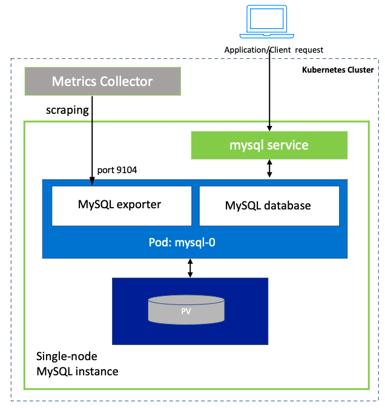


Let's view our **Petclinic app**. First, we launch it:
```execute
kubectl delete deployment petclinic-app --ignore-not-found=true --namespace={{ session_namespace }} && kubectl delete svc petclinic-app --ignore-not-found=true --namespace={{ session_namespace }} && sed -i "s/YOUR_SESSION_NAMESPACE/{{ session_namespace }}/g" ~/other/resources/petclinic/petclinic-app-h2.yaml && kubectl apply -f ~/other/resources/petclinic/petclinic-app-h2.yaml
```

Check on the status by viewing the logs (**L** on K9s). Click **Esc**  when complete.

Next, we view it:
```dashboard:open-url
url: {{ ingress_protocol }}://petclinic-{{ session_namespace }}.{{ DATA_E2E_BASE_URL }}
```

Let's go ahead and add a few new pet owners, then restart the app. We notice that if we restart the app, we lose all of our entries:
```execute
kubectl rollout restart deploy/petclinic-app && kubectl rollout status -w deployment/petclinic-app
```

Let's view it again - notice the owners are gone:
```dashboard:reload-dashboard
name: Petclinic
url: {{ ingress_protocol }}://petclinic-{{ session_namespace }}.{{ DATA_E2E_BASE_URL }}
```

To resolve this, we will need to provision a persistent data store.



**Tanzu MySQL** is a _full-featured_, fast/easy-to-use relational data store.

Let's deploy the Tanzu MySQL **operator**:

```execute
kubectl create secret docker-registry image-pull-secret --namespace=default --docker-username='{{ DATA_E2E_REGISTRY_USERNAME }}' --docker-password='{{ DATA_E2E_REGISTRY_PASSWORD }}' --dry-run -o yaml | kubectl apply -f - && kubectl create secret docker-registry image-pull-secret --namespace={{ session_namespace }} --docker-username='{{ DATA_E2E_REGISTRY_USERNAME }}' --docker-password='{{ DATA_E2E_REGISTRY_PASSWORD }}' --dry-run -o yaml | kubectl apply -f - && helm uninstall mysql --namespace default; helm uninstall mysql --namespace mysql-system; helm uninstall mysql --namespace {{ session_namespace }}; for i in $(kubectl get clusterrole | grep mysql); do kubectl delete clusterrole ${i} > /dev/null 2>&1; done; for i in $(kubectl get clusterrolebinding | grep mysql); do kubectl delete clusterrolebinding ${i} > /dev/null 2>&1; done; for i in $(kubectl get certificate -n cert-manager | grep mysql); do kubectl delete certificate -n cert-manager ${i} > /dev/null 2>&1; done; for i in $(kubectl get clusterissuer | grep mysql); do kubectl delete clusterissuer ${i} > /dev/null 2>&1; done; for i in $(kubectl get mutatingwebhookconfiguration | grep mysql); do kubectl delete mutatingwebhookconfiguration ${i} > /dev/null 2>&1; done; for i in $(kubectl get validatingwebhookconfiguration | grep mysql); do kubectl delete validatingwebhookconfiguration ${i} > /dev/null 2>&1; done; for i in $(kubectl get crd | grep mysql); do kubectl delete crd ${i} > /dev/null 2>&1; done; helm install mysql ~/other/resources/mysql/operator{{DATA_E2E_MYSQL_OPERATOR_VERSION}} -f ~/other/resources/mysql/overrides.yaml --namespace {{ session_namespace }} --wait &> /dev/null
```

The operator deploys a set of **Custom Resource Definitions** which encapsulate various advanced, DB-specific concepts as managed Kubernetes resources. 
The main advantage of the Operator pattern comes from its declarative approach. 
Users can focus on defining domain objects,
while delegating their underlying implementation logic to the operator's controller, which manages their state via reconciliation loops.

Here is a list of the **Custom Resource Definitions** that were deployed by the operator:

```execute
clear && kubectl api-resources --api-group=with.sql.tanzu.vmware.com
```

Next, let's deploy a highly available Tanzu MySQL **cluster**. Here is the manifest:
```editor:open-file
file: ~/other/resources/mysql/mysql-cluster.yaml
```

Let's deploy it:
```execute
kubectl apply -f ~/other/resources/mysql/mysql-cluster.yaml -n {{ session_namespace }}
```

This configuration will deploy a MySQL cluster with 1 **primary** node,
2 **secondary** nodes for failover, and 2 **proxy** nodes for routing requests to the primary node.
View the complete configuration associated with the newly deployed MySQL cluster:
```execute
kubectl get mysql mysqlinstance-1 -o yaml
```


After that, we can redeploy our app:
```execute
export tmp_db_db=$(kubectl get secrets pginstance-1-db-secret -o jsonpath='{.data.dbname}' | base64 --decode) && export tmp_db_user=$(kubectl get secrets pginstance-1-db-secret -o jsonpath='{.data.username}' | base64 --decode) && export tmp_db_pass=$(kubectl get secrets pginstance-1-db-secret -o jsonpath='{.data.password}' | base64 --decode) && kubectl delete deployment petclinic-app --ignore-not-found=true --namespace={{ session_namespace }} && kubectl delete svc petclinic-app --ignore-not-found=true --namespace={{ session_namespace }} && sed -i "s/YOUR_SESSION_NAMESPACE/{{ session_namespace }}/g" ~/other/resources/petclinic/petclinic-app-MySQL.yaml && sed -i "s/YOUR_DATASOURCE_URL/jdbc:MySQLql:\/\/pginstance-1:5432\/${tmp_db_db}/g" ~/other/resources/petclinic/petclinic-app-MySQL.yaml && sed -i "s/YOUR_DATASOURCE_USERNAME/${tmp_db_user}/g" ~/other/resources/petclinic/petclinic-app-MySQL.yaml && sed -i "s/YOUR_DATASOURCE_PASSWORD/${tmp_db_pass}/g" ~/other/resources/petclinic/petclinic-app-MySQL.yaml && kubectl apply -f ~/other/resources/petclinic/petclinic-app-MySQL.yaml
```

This time, our data persists even after restarting:
```execute
export tmp_db_db=$(kubectl get secrets pginstance-1-db-secret -o jsonpath='{.data.dbname}' | base64 --decode) && export tmp_db_user=$(kubectl get secrets pginstance-1-db-secret -o jsonpath='{.data.username}' | base64 --decode) && export tmp_db_pass=$(kubectl get secrets pginstance-1-db-secret -o jsonpath='{.data.password}' | base64 --decode) && kubectl delete deployment petclinic-app --ignore-not-found=true --namespace={{ session_namespace }} && kubectl delete svc petclinic-app --ignore-not-found=true --namespace={{ session_namespace }} && sed -i "s/YOUR_SESSION_NAMESPACE/{{ session_namespace }}/g" ~/other/resources/petclinic/petclinic-app-MySQL-2.yaml && sed -i "s/YOUR_DATASOURCE_URL/jdbc:MySQLql:\/\/pginstance-1:5432\/${tmp_db_db}/g" ~/other/resources/petclinic/petclinic-app-MySQL-2.yaml && sed -i "s/YOUR_DATASOURCE_USERNAME/${tmp_db_user}/g" ~/other/resources/petclinic/petclinic-app-MySQL-2.yaml && sed -i "s/YOUR_DATASOURCE_PASSWORD/${tmp_db_pass}/g" ~/other/resources/petclinic/petclinic-app-MySQL-2.yaml && kubectl apply -f ~/other/resources/petclinic/petclinic-app-MySQL-2.yaml
```



#### Demonstrating HA

Connect to the new MySQL instance via **phpMyAdmin**, a popular web-based MySQL client.
<font color='red'>NOTE: Wait for all 5 pods to show up in the lower console view before running.</font>
First, set up **phpMyAdmin** to connect to the MySQL instance:
```execute
tmpfile=$(mktemp) && kubectl cp mysqlinstance-1-0:$(kubectl exec mysqlinstance-1-0 --container=mysql -- env | grep MYSQL_ROOT_PASSWORD_FILE | sed s/MYSQL_ROOT_PASSWORD_FILE=//) $tmpfile && export MYSQL_ROOT_PASSWORD=$(cat $tmpfile) && sed -i "s/YOUR_SESSION_NAMESPACE/{{ session_namespace }}/g" ~/other/resources/phpMyAdmin/phpMyAdmin.yaml && sed -i "s/YOUR_ROOT_PASSWORD/$(echo $MYSQL_ROOT_PASSWORD | base64 )/g" ~/other/resources/phpMyAdmin/phpMyAdmin.yaml && kubectl apply -f ~/other/resources/phpMyAdmin/phpMyAdmin.yaml
```

Launch **phpMyAdmin**:
```dashboard:open-url
url: http://phpadmin-{{session_namespace}}.{{ DATA_E2E_BASE_URL }}/
```

In keeping with best practices, create a new user to access the MySQL Server instance, instead of using the root user. Login to the MySQL bash console:
```execute
kubectl exec -it mysqlinstance-1-0 -c mysql -- bash
```

Create a new user **demo** with password **newpass**:
```execute
mysql -B -s --user=root --password=$(cat $MYSQL_ROOT_PASSWORD_FILE) --execute "CREATE USER 'demo'@'%' IDENTIFIED BY 'newpass'; GRANT ALL PRIVILEGES ON *.* TO 'demo'@'%'; FLUSH PRIVILEGES;"; exit
```

Use the credentials emitted below to login to **phpMyAdmin**:
```execute
printf "Server: mysqlinstance-1.{{session_namespace}}\nUnder Connection tab:\n  Host name: mysqlinstance-1.{{session_namespace}}.svc.cluster.local\n  Maintenance Database: mysql\n  Username: demo\n  Password: newpass\n"
```

Once connected, copy the following query to the query box in **phpMyAdmin** (under the SQL tab), then click on "Go" to execute:
```copy
SELECT * FROM performance_schema.replication_group_members;
```

Tanzu MySQL uses **InnoDB Cluster** for high availability. A highly-available Tanzu MySQL cluster consists of 5 nodes: 
the **primary/read-write** node which handles query requests, 
2 **secondary/read-only/failover** nodes which perform synchronous replication with the primary node, 
and 2 **proxy nodes** which use MySQL Router to route requests to the primary node.

Let's demonstrate HA by killing the primary node by <b>selecting the primary node in the lower console and hitting <font color="red">Ctrl-K</font>.</b>
Observe the activity in the cluster by running the query below in **phpMyAdmin** to view the new primary and secondary nodes:
```copy
SELECT * FROM performance_schema.replication_group_members;
```

#### Backups and Restores
Tanzu MySQL includes **Percona XtraBackup** as its backup-restore solution for MySQL backups, using an S3-compatible store.
(**Percona XtraBackup** is the leading backup-restore solution for Percona-backed MySQL databases.
It supports **hot backups** - a non-blocking operation which allows the database to remain online while backups are in progress. This is supported 
for MyISAM and XtraDB tables, not just InnoDB tables.
It also provides features such as highly compressed backups for efficient network bandwidth/storage utilization and faster restores (the latter resulting 
in increased uptime/improved RTO),
built-in backup verification, and support for full or incremental and bacula backups.

Here, we will use **Minio** for backup storage.

First, get the Minio login credentials:
```execute
clear &&  mc config host add --insecure data-fileingest-mysql https://{{DATA_E2E_MINIO_URL}} {{DATA_E2E_MINIO_ACCESS_KEY}} {{DATA_E2E_MINIO_SECRET_KEY}} && printf "Username: $(kubectl get secret minio -o jsonpath="{.data.accesskey}" -n minio | base64 --decode)\nPassword: $(kubectl get secret minio -o jsonpath="{.data.secretkey}" -n minio| base64 --decode)\n"
```

Let's create a new bucket for our **mysqldata** backups:
```execute
mc rb --force --insecure data-fileingest-mysql/mysql-backups; mc mb --insecure -p data-fileingest-mysql/mysql-backups && mc policy --insecure set public data-fileingest-mysql/mysql-backups
```

View the newly created bucket (login with the _Username_ and _Password_ printed earlier):
```dashboard:open-url
url: https://minio.{{ DATA_E2E_BASE_URL }}/
```

Next, let's view the manifest that we would use to configure the backup location:
```editor:open-file
file: ~/other/resources/mysql/mysql-backup-location.yaml
```

To support *TLS backend stores*, the CA bundle must be included in the *MySQLBackupLocation* configuration.
First, copy the CA bundle:
```execute
kubectl get secret tls-ssl-minio -nminio  -o jsonpath='{.data.public\.crt}' | base64 --decode
```

Replace the section of the configuration (that starts with *YOUR_CA_CRT* and ends with *---END CERTIFICATE---*) with the content of the CA bundle you just copied:
```editor:open-file
file: ~/other/resources/mysql/mysql-backup-location.yaml
```

Deploy the configuration for the backup location:
```execute
kubectl apply -f ~/other/resources/mysql/mysql-backup-location.yaml  -n {{ session_namespace }}
```

Let's take a look at the backup configuration that was just deployed:
```execute
kubectl get mysqlbackuplocation my-simple-backuplocation -o jsonpath={.spec} -n {{ session_namespace }} | jq
```

Next, trigger an on-demand backup by deploying a new **MySQLBackup** definition. View the manifest:
```editor:open-file
file: ~/other/resources/mysql/mysql-backup.yaml
```

Deploy the backup definition:
```execute
kubectl apply -f ~/other/resources/mysql/mysql-backup.yaml -n {{ session_namespace }}
```

View the backup progress here: <font color="red">NOTE</font>: Hit **Ctrl-C** when the backup process shows as Completed.
```execute
watch kubectl get mysqlbackup my-backup-sample -n {{ session_namespace }}
```

View the generated backup files on Minio:
```dashboard:open-url
url: https://minio.{{ DATA_E2E_BASE_URL }}/
```

In addition to on-demand backups, Tanzu MySQL supports scheduled backup jobs. Here's a manifest that will set up a daily backup job for our MySQL instance to be backed up to our previously defined location:
```editor:open-file
file: ~/other/resources/mysql/mysql-backup-schedule.yaml
```

Deploy the scheduled backup job:
```execute
kubectl apply -f ~/other/resources/mysql/mysql-backup-schedule.yaml -n {{ session_namespace }}
```

Verify the details of the scheduled job:
```execute
kubectl get mysqlbackupschedule my-simple-backupschedule -o jsonpath={.spec} -n {{ session_namespace }} | jq
```

Soon, a set of scheduled jobs will be deployed (shown in the lower console window).

Next, view the backup files in Minio: <font color="red">NOTE: The **.xb** backup files will be stored under a _YYYY > MM > DD_ folder substructure by default.</font>
```dashboard:open-url
url: https://minio.{{ DATA_E2E_BASE_URL }}/
```

Now, let's perform a restore. In this case, we will downscale the HA instance to a new single-node DB. View the manifest:
```editor:open-file
file: ~/other/resources/mysql/mysql-restore.yaml
```

Trigger the restore:
```execute
kubectl apply -f ~/other/resources/mysql/mysql-restore.yaml -n {{ session_namespace }}
```

Verify the status of the restore:
```execute
watch kubectl get mysqlrestore my-restore-sample -n {{ session_namespace }}
```

You can also view the logs generated from the restore process <font color="red">NOTE: Hit **Ctrl-C** to escape:</font>
```execute
kubectl logs -ljob-name=restore-job-my-restore-sample -f
```

#### Monitoring MySQL Data

Tanzu MySQL includes a **MySQL Exporter** which collects and exposes Prometheus metrics via a _/metrics_ endpoint.

Show a sampling of the emitted metrics:

```execute
clear; kubectl port-forward mysqlinstance-1-0 9104:9104 > /dev/null & TMP_PG_PROC=$!; sleep 2; curl -k https://localhost:9104/metrics
```

Kill the port-forward to proceed:
```execute
kill -9 $TMP_PG_PROC
```

Now that the Prometheus metrics are being exposed, we will be able to deploy a **forwarder** which will scrape the Prometheus endpoints and forward the metrics to the Prometheus aggregator.
The Prometheus operator provides a **PodMonitor** which will handle scraping and forwarding the exposed MySQL metrics.

Set up the **PodMonitor**:
```editor:open-file
file: ~/other/resources/mysql/mysql-pod-monitor.yaml
```

Deploy the **PodMonitor**:
```execute
kubectl apply -f ~/other/resources/mysql/mysql-pod-monitor.yaml
```

Next, navigate to the Prometheus UI, select Status -> Targets and click "Collapse All" - _podMonitor_ metrics 
should be shown (<font color="red">NOTE:</font> Wait for a few seconds if the metrics do not show up right away):
```dashboard:open-url
name: Prometheus
url: http://prometheus.{{ DATA_E2E_BASE_URL }}
```

<font color="red">NOTE:</font> To view specific metrics collected by Prometheus, go the the Prometheus UI Home screen by 
clicking on "Prometheus" in the menu bar, and enter **mysql** in the Search bar. A list of metrics should be populated in the field.

#### Rotating Credentials
