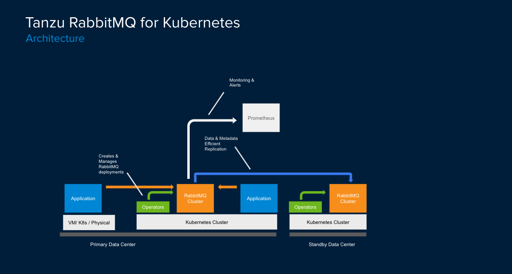

### Deploying Tanzu RabbitMQ

**Tanzu RabbitMQ** is a _full-featured_ enterprise-grade message broker.

First, let's update our **default** service account user with the RBAC permissions it needs to deploy the operator - here are the RBAC permissions:
```editor:open-file
file: ~/other/resources/rabbitmq/rabbitmq-operator-rbac.yaml
```

Let's deploy it:
```execute
clear && kubectl create ns rabbitmq-system --dry-run -o yaml | kubectl apply -f - && kubectl apply -f ~/other/resources/rabbitmq/rabbitmq-operator-rbac.yaml -n rabbitmq-system && kubectl create clusterrolebinding tanzu-rabbitmq-crd-install-binding --clusterrole=tanzu-rabbitmq-crd-install --serviceaccount=rabbitmq-system:default -n rabbitmq-system --dry-run -o yaml | kubectl apply -n rabbitmq-system -f - 
```

We will also need to create a Secret for pulling from the **Tanzu RabbitMQ** package's container registry,
export the Secret to all namespaces (using a **SecretExport**), and create a secret placeholder for importing it (called a **Placeholder Secret**):
```editor:open-file
file: ~/other/resources/rabbitmq/rabbitmq-operator-secretexport.yaml
```

Create the **SecretExport** and **Placeholder Secret**:
```execute
kubectl create secret docker-registry image-pull-secret --namespace=rabbitmq-system --docker-username='{{ DATA_E2E_REGISTRY_USERNAME }}' --docker-password='{{ DATA_E2E_REGISTRY_PASSWORD }}' --dry-run -o yaml | kubectl apply -f - && sed -i "s/YOUR_SESSION_NAMESPACE/{{ session_namespace }}/g" ~/other/resources/rabbitmq/rabbitmq-operator-secretexport.yaml && kubectl apply -f ~/other/resources/rabbitmq/rabbitmq-operator-secretexport.yaml
```

Now we can deploy the Tanzu RabbitMQ **Operators**.
<font color="red">NOTE: this will include the **Cluster Operator**, **Message Topology Operator** and the **Standby Replication** operator.</font>

First, deploy the **Package Repository** which will make the **Tanzu RabbitMQ** package available to the cluster:
```editor:open-file
file: ~/other/resources/rabbitmq/rabbitmq-operator-packagerepository.yaml
```

Let's deploy the **Package Repository**:
```execute
kapp delete -a tanzu-rabbitmq-repo -y -nrabbitmq-system; kapp deploy -a tanzu-rabbitmq-repo -f ~/other/resources/rabbitmq/rabbitmq-operator-packagerepository.yaml -y -nrabbitmq-system
```

Verify that the **Tanzu RabbitMQ** repository is now available.
<font color="red">NOTE: Hit **Ctrl-C** to exit once it shows "Reconcile succeeded":</font>
```execute
watch kubectl get packagerepository tanzu-rabbitmq-repo -nrabbitmq-system
```

Next, we'll deploy the **Package Install** which will actually install the **Tanzu RabbitMQ** package made available earlier.
```editor:open-file
file: ~/other/resources/rabbitmq/rabbitmq-operator-packageinstall.yaml
```

Let's install the **Tanzu RabbitMQ** operator by deploying the **Package Install**:
```execute
export RABBIT_KAPP_INST=$(kubectl get packageinstall -n rabbitmq-system -ojson | jq '.items[] | .metadata.labels["kapp.k14s.io/app"]' | tr -d '"'); kapp delete -a tanzu-rabbitmq -y -nrabbitmq-system; kubectl get validatingwebhookconfiguration -l kapp.k14s.io/app=$RABBIT_KAPP_INST -o name | xargs -r kubectl delete; kubectl get clusterrolebinding -l kapp.k14s.io/app=$RABBIT_KAPP_INST -o name | xargs -r kubectl delete; kubectl get clusterrole -l kapp.k14s.io/app=$RABBIT_KAPP_INST -o name | xargs -r kubectl delete; kubectl apply -f ~/other/resources/rabbitmq/rabbitmq-operator-packageinstall.yaml -nrabbitmq-system; ~/other/resources/operator-ui/annotate.sh; kubectl annotate pkgi tanzu-rabbitmq ext.packaging.carvel.dev/ytt-paths-from-secret-name.0=rabbitmq-operator-tsqlui-annotation-overlay-secret -nrabbitmq-system --overwrite 
```

Verify that the install was successful. <font color="red">NOTE: Hit **Ctrl-C** to exit once it shows "Reconcile succeeded":</font>
```execute
watch kubectl get packageinstalls -nrabbitmq-system
```

The **krew** plugin provides a native approach for managing RabbitMQ clusters. View a list of supported commands:
```execute
export PATH="${PATH}:${HOME}/.krew/bin" && kubectl krew install rabbitmq  && kubectl rabbitmq help
```

Next, let's deploy a highly available Tanzu RabbitMQ **cluster**. Here is the manifest:
```editor:open-file
file: ~/other/resources/rabbitmq/rabbitmq-cluster.yaml
```

First deploy a cluster with just 1 replica:
```execute
kubectl apply -f ~/other/resources/rabbitmq/rabbitmq-cluster-monitor.yaml; kubectl apply -f ~/other/resources/rabbitmq/rabbitmq-cluster.yaml -n {{ session_namespace }};
```

Create an Ingress for the Management UI:
<font color="red">Wait for cluster nodes to show up before running</font>
```execute
kubectl wait --for=condition=Ready pod/rabbitcluster1-server-0 -n {{ session_namespace }} && cat ~/other/resources/rabbitmq/rabbitmq-httpproxy.yaml | sed -e s/__TOKEN__/{{ session_namespace }}/g | kubectl apply -n {{ session_namespace }} -f -
```

Meanwhile, let's take a look at a pre-built Grafana dashboard. It has been integrated with a Prometheus service which has auto-detected our cluster.
```dashboard:open-url
url: {{ ingress_protocol }}://grafana.{{ ingress_domain }}
```

<font color="red">Use the credentials below to login to the Grafana dashboard:</font>
```execute
printf "Username: admin\nPassword: $(kubectl get secret grafana-admin --namespace monitoring-tools -o jsonpath="{.data.GF_SECURITY_ADMIN_PASSWORD}" | base64 --decode)\n"
```

We can also view a pre-built metrics dashboard in **Wavefront**. To enable this, the **Wavefront Collector** for Kubernetes is required to forward metrics emitted by RabbitMQ (via the **rabbitmq_prometheus** plugin) to the Wavefront proxy. Install it now:
```execute
kubectl apply -f ~/other/resources/wavefront.yaml -n default && kubectl apply -f ~/other/resources/wavefront-collector.yaml -n wavefront-collector
```

View the Wavefront dashboard:
```dashboard:open-url
url: https://vmware.wavefront.com/u/Cn2TlXWTDl?t=vmware
```

We can also view the Management UI, which is also pre-integrated with the Tanzu RabbitMQ operator.
```dashboard:create-dashboard
name: RabbitMQ
url: {{ ingress_protocol }}://rabbit{{ session_namespace }}.{{ ingress_domain }}
```

To login, you need the UI credentials:
```execute
kubectl get secret rabbitcluster1-default-user -o jsonpath="{.data.default_user\.conf}" | base64 --decode
```


Sometimes, the ideal use case is to leverage RabbitMQ transparently as the messaging transport layer, without having to be aware of its inner workings or semantics. For that, we will leverage  **Spring Cloud Data Flow**. We will build a file ingestion pipeline next.



#### AUTHENTICATION AND AUTHORIZATION
After the client establishes the initial handshake of a successful TLS connection with the RabbitMQ broker, it must go through the authentication and authorization checks that have been pre-configured on the broker.

Locate the primary RabbitMQ node and type **s** in the lower console window to launch the **RabbitMQ** node's shell: 
```execute-2
s
```

Create a new user called **demo** which will have access to the Management UI and full access to the default virtual host.
```execute-2
rabbitmqctl add_user demo CHANGEME && rabbitmqctl set_permissions  -p / demo ".*" ".*" ".*" && rabbitmqctl set_user_tags demo administrator
```

Observe that we used the command line management tool, **rabbitmqctl**, which is able to perform most RabbitMQ management operations:
```execute-2
rabbitmqctl help
```

Exit the shell:
```execute-2
exit
```

Now login to the RabbitMQ management UI with credentials **demo/CHANGEME** - observe that the user has full access to the default **/** virtual host.

#### BUILT-IN CLUSTERING
A cluster is a logical grouping of resources whereby the state and data of a RabbitMQ environment is distributed across multiple nodes. By default, RabbitMQ deploys resources - virtual hosts, exchanges, users, user permissions, non-replicated queues - to a single node. To convert it to a multi-node system, new nodes need to be explicitly added to the topology. This can be done declaratively via config file or plugins, or manually via **rabbitmqctl** cli. 

The typical reasons for converting a single-node system into a distributed system apply: increased availability, increased fault tolerance, increased data safety, increased load distribution and improved resource utilization, increased concurrency support. 

Next, scale the cluster to 3 replicas (odd number is recommended). In the vim editor that comes up, edit the number of replicas from 1 to 3 (replace the phrase **replicas: 1**):
```execute
kubectl edit rabbitmqcluster rabbitcluster1 -n {{ session_namespace }}
```

### UPGRADING TO TANZU RABBITMQ
So far, the RabbitMQ  broker that we've deployed has been the OSS broker:
```dashboard:reload-dashboard
name: RabbitMQ
url: {{ ingress_protocol }}://rabbit{{ session_namespace }}.{{ ingress_domain }}
```

Upgrade the cluster to the Tanzu RabbitMQ distribution by updating the OCI image and perform a rolling upgrade. In the vim editor that comes up, edit the **image** field:
```execute
kubectl edit rabbitmqcluster rabbitcluster1 -n {{ session_namespace }}
```

Change the container image to point to the specified path below:
```copy
oawofolu/vmware-tanzu-rabbitmq:{{DATA_E2E_RABBIT_OPERATOR_VERSION}}
```

<font color="red">(<b>Discuss rolling upgrade</b>)</font>

Watch the rolling upgrade as it updates each node one by one. Once it completes, observe that the nodes have been successfully upgraded to use Tanzu RabbitMQ:

In the Grafana Dashboard:
```dashboard:open-url
url: {{ ingress_protocol }}://grafana.{{ ingress_domain }}
```

In the RabbitMQ Management UI (lougout, then log back in using credentials **demo/CHANGEME**):
```dashboard:reload-dashboard
name: RabbitMQ
url: {{ ingress_protocol }}://rabbit{{ session_namespace }}.{{ ingress_domain }}
```