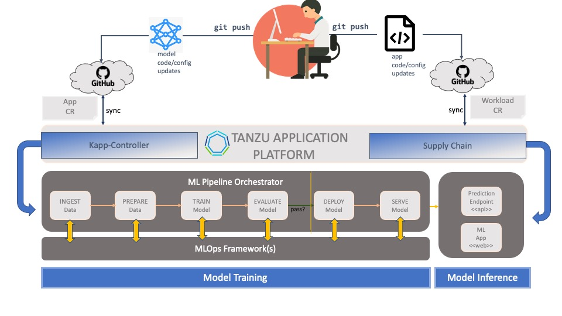

### Before We Begin: Scoping the Problem

#### Training a Convolutional Neural Network on TAP

In this session, we will demonstrate how **Tanzu Application Platform** enables **MLOps** with a conventional _supervised learning_ use case.
We will build an image classifier that will be able to identify objects by name.
Our classifier will be trained on a limited number of *labels* from the well-known **CIFAR 10** dataset.
For the purposes of this exercise, we will build our model from scratch using the popular **Tensorflow (Keras)** framework.
We will demonstrate **transfer learning** (using a *pre-trained model*) in a future exercise.

Let's begin!

