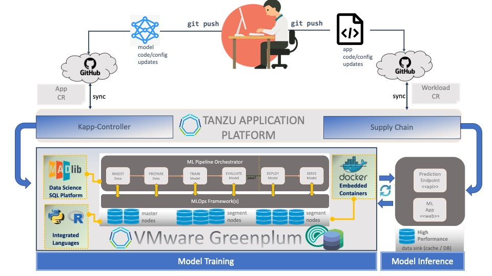

### VMware Greenplum

**VMware Greenplum** is a _massively parallel processing (MPP)_, _open-source_ based, _Big Data_ architecture 
for large scale analytics (up to petabyte-scale).

In this session, we will demonstrate how **Greenplum** integrates with **Tanzu Application Platform** 
for a reliable, end-to-end **MLOps** process.

#### Training a Convolutional Neural Network on TAP

Let's begin!

