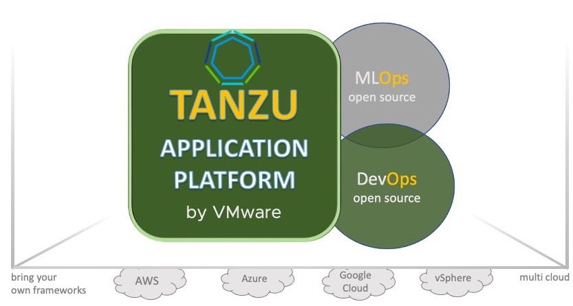
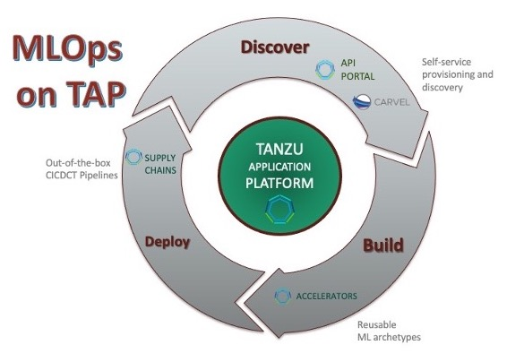

### Tanzu Application Platform

**Tanzu Application Platform** is a _multi-cloud_, _open-source_ based, _DevOps_ platform for deploying and managing
the full spectrum of ML workloads - **pipelines**, **models**, **code** and **data** - from end to end.

It provides the ability to support **MLOps** with **_mix-and-match flexibility_**. 
Users can combine multiple different ML frameworks and solutions, 
or extend features from a single ML framework with DevOps-friendly built-ins.

#### MLOps on TAP: A High-Level Overview

#### Our Agenda 

We will use **Tanzu Application Platform** as the **command center** and **hub** for all of our machine learning workloads.
We will bring a mix of ML frameworks, tools and workloads to **Tanzu Application Platform**, 
and use **TAP** as our **command center** for plugging our ML artifacts into an end-to-end lifecycle.

Specifically, **Tanzu Application Platform** supports our machine learning process in the following phases:

1. **Discover** Phase
  

  _**Training Environment**_

  In order to get started, we will need to set up our **training environment**. 
  For this, we need access to a slew of off-the-shelf **ML frameworks and tools**: products like **JupyterHub**, **MLFlow**, etc. 
  We can also include a hodgepodge of our favorite homegrown ML frameworks / tooling, as long as they are container native.

  _**Data Assets**_

  Additionally, we will need access to quality **data assets** for our ML experiments, in order to facilitate efficient **data collection and ingestion**. 
  This step is usually the most critical stage of the ML lifecycle, as the success of our model deployment often begins and ends with the quality of the data.
  Ideally, data assets should be registered with a **data catalog**, with adequate **governance** and **policy controls**,
  and they should be easily **discoverable** via well-defined, standardized protocols.

  All of this can be achieved with **TAP**. **Tanzu Application Platform** provides a **discovery** layer for **discovering**, **consuming**, **registering** and **self-service provisioning** 
  of Data / ML products and assets. We will see some of this in action in the upcoming exercise.

2. **Build** Phase
  
  _**Reusable Prototypes**_

  Once the ML environment and Data assets are in place, we should now be ready to proceed to the **Build** phase: 
  training, tuning, experimentation and prototyping required to build our **ML Model**. This is an **iterative step**
  which we will continually revisit throughout the lifetime of our model.
  

  One of the main objectives in this phase is to reduce the **lead time** for building models. 
  The lead time for ML models for most enterprises is usually quite high, with an average of about 3 months. 
  Traditionally, one of the bottlenecks in this stage has been **boilerplate tasks**. 
  There are many of these boilerplate tasks, such as:
  * _building a **container-native ML pipeline** using a preferred framework - MLFlow, Kubeflow, Airflow, Nifi, Argo Workflows, etc._
  * _converting Jupyter code into **production-ready code**_
  * _setting up / consuming database connections_
  * _generating Jupyter notebooks for common ML **regression / classification** problems_
  * _setting up unit tests and monitoring code_
  * _etc. etc._
  
  
  **Tanzu Application Platform** resolves this by providing **accelerators**: recipes / templates for common ML tasks 
  that can be adapted during the ML lifecycle process to reduce lead times. We will be able to explore this in the upcoming exercise.

3. **Deploy** Phase

  _**Supply Chains**_

  After the Build phase, we need to deploy our model to production. 
  Model deployment is considered to be one of the greatest challenges in modern machine learning, 
  with only about a **10% success rate** according to recent surveys.
  Most model deployments are performed **manually**, which exacerbates the challenges 
  by making deployments less repeatable, slower, less scalable, more error-prone, and difficult to monitor.
  
  Automating the model deployment process using CICD pipelines helps to remove some of these challenges.
  This can be achieved with Tanzu Application Platform **Supply Chains**.
  **Supply Chains** are CICD-native, out-of-the-box templates for simplifying the process of 
  deploying and managing automated pipelines for ML workloads. We will also explore this in the upcoming exercise.

