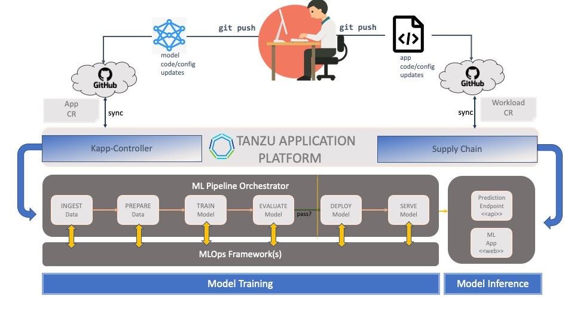

### Tanzu Application Platform

**Tanzu Application Platform** is a _multi-cloud_, _open-source_ based, _DevOps_ platform for deploying and managing
the full spectrum of ML workloads - **pipelines**, **models**, **code** and **data** - from end to end.

It provides the ability to support **MLOps** with **_mix-and-match flexibility_**. 
Users can combine multiple different ML frameworks and solutions, 
or extend features from a single ML framework with DevOps-friendly built-ins.

#### MLOps on TAP: A High-Level Overview


In this session, we will demonstrate how **Tanzu Application Platform** enables **MLOps** with a conventional _supervised learning_ use case. 
We will build an image classifier that will be able to identify objects by name.
Our classifier will be trained on a limited number of *labels* from the well-known **CIFAR 10** dataset.
For the purposes of this exercise, we will build our model from scratch using the popular **Tensorflow (Keras)** framework.
We will demonstrate using a pre-trained model in a future exercise.

#### Training a Convolutional Neural Network on TAP


Let's begin!

Let's view our **Petclinic app**. First, we launch it:
```execute
kubectl delete deployment petclinic-app --ignore-not-found=true --namespace={{ session_namespace }} && kubectl delete svc petclinic-app --ignore-not-found=true --namespace={{ session_namespace }} && sed -i "s/YOUR_SESSION_NAMESPACE/{{ session_namespace }}/g" ~/other/resources/petclinic/petclinic-app-h2.yaml && kubectl apply -f ~/other/resources/petclinic/petclinic-app-h2.yaml
```

Check on the status by viewing the logs (**L** on K9s). Click **Esc**  when complete.

Next, we view it:
```dashboard:open-url
url: {{ ingress_protocol }}://petclinic-{{ session_namespace }}.{{ DATA_E2E_BASE_URL }}
```


